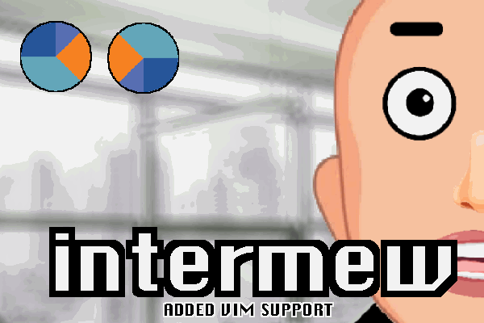
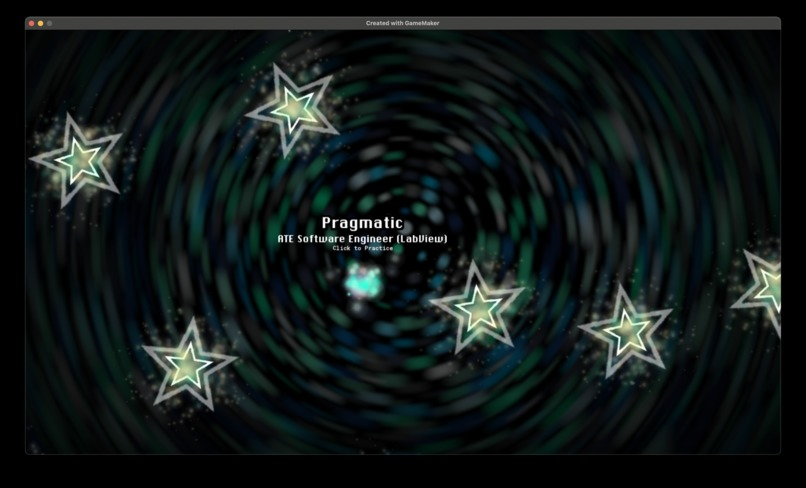
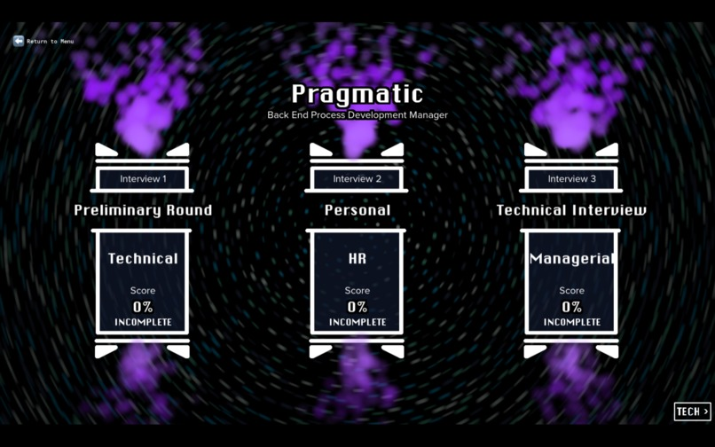
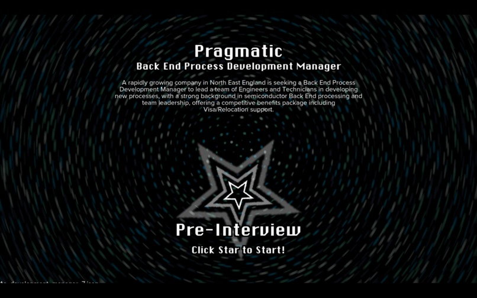
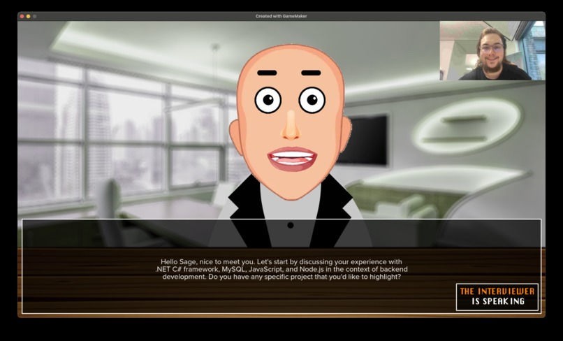
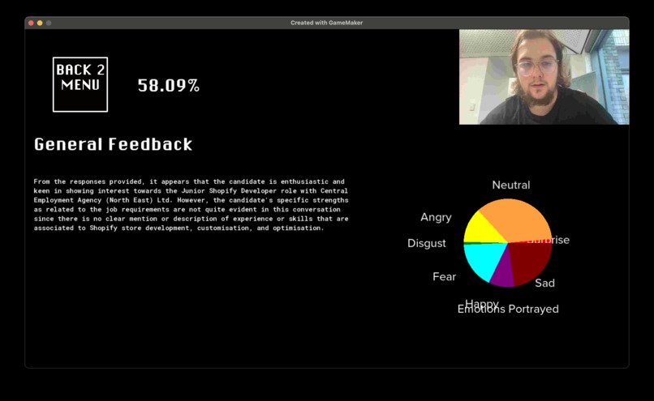
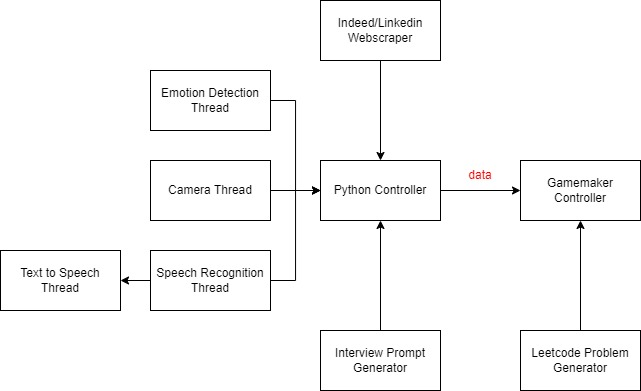

<!-- Improved compatibility of back to top link: See: https://github.com/pull/73 -->

<!-- PROJECT LOGO -->
 

  

  <h3 align="center">Intermew</h3>

  

    👨‍💻 Realistic, generative simulated interviews for Durhack 2024. Built using Webscraping, OpenCV, Deepface, Whisper, OpenAI and Gamemaker.
     
     
    <a href="https://devpost.com/software/intermew">View Devpost</a>
    ·
    <a href="https://github.com//tobybenjaminclark/intermew/issues">Report Bug</a>
    ·
    <a href="https://github.com/tobybenjaminclark/intermew/issues">Request Feature</a>
  

<!-- ABOUT THE PROJECT -->
## About The Project
Navigate the expanse of space, visit stars (job listings), and conquer them (pass interviews). If you manage to pass, you get the URL to actually apply. Inspired by the growing trend of remote IT interviews, *Intermew* aims to provide a gamified environment to help users refine their interview skills.

With ~75% of IT interviews being conducted remotely, do you have what it takes to pass? This game uses real-world job listings scraped from Indeed to **generate a realistic interview experience**. Players engage in a three-stage interview, answering questions specific to the job listings, while being evaluated on their semantic performance (do you know your stuff?), attitude (emotion and facial expression tracking), and head positioning (keep that head centered!).

We wanted to challenge ourselves by integrating a wide variety of technologies into a **single hackathon project**. The system involves web scraping, facial recognition, speech recognition, coding challenges, and live feedback—all while navigating through space to find job listings!

  

(<a href="#readme-top">back to top</a>)

<!-- USAGE EXAMPLES -->
## Description
##### Webscraping & Job Data (Stage 1)
Intermew begins by scraping job listings from Indeed, focusing on Durham-based roles from the past month. This data is used to generate interview questions that are highly specific to the job description, salary, and required skills.

  

 Mystic cluster of magical orbs (player) navigating deep-space (the job market)

##### Interview Rounds & Job Description
Once the job has been selected, the program generates 3 interview rounds with specific themes, followed by a generated, clean description of the role.

  

  

 Interview Rounds & Descriptions

##### Interview Simulation
The user is then put through a series of interview stages using the Chatbot powered by GPT-4. The interview questions are dynamic, based on the job listing data, and adapt in real-time. Additionally, the system tracks the user's facial expressions using computer vision to monitor their attitude throughout the interview.

  

This actually uses `Whisper` for Speech Recognition and Text to Speech, and is controlled through Python, and interfaced over a socket connection by gamemaker.

##### Coding Interviews & VIM Editor
The final stage involves answering technical questions, which are scraped from Leetcode. These coding challenges are answered in a custom VIM-style editor developed in Gamemaker. The editor is minimalistic but effective, providing a functional interface for coding problems.

##### Emotion & Head Tracking
The game uses facial recognition to track emotions and head movements. Players are evaluated on how well they maintain the correct attitude and keep their head centered in the frame. These metrics are visualized for feedback at the end of the interview.

##### Feedback
After the interview, the user is scored on their performance and this is given back to them. Their emotions are shown in a pie chart, with generic feedback being provided by ChatGPT afterwards.

  

(<a href="#readme-top">back to top</a>)

## Architecture

  

<!-- CONTRIBUTING -->
## Contributing
Since the project was developed within a 24-hour hackathon, there may be a lack of detailed documentation and a few bugs to work through. However, if you're excited to contribute, feel free to fork the project, create a feature branch, and raise an issue!

1. Fork the Project
2. Create your Feature Branch (`git checkout -b feature/AmazingFeature`)
3. Commit your Changes (`git commit -m 'Add some AmazingFeature'`)
4. Push to the Branch (`git push origin feature/AmazingFeature`)
5. Open a Pull Request

(<a href="#readme-top">back to top</a>)

<!-- LICENSE -->
## License
Distributed under the MIT License. See `LICENSE.txt` for more information.

(<a href="#readme-top">back to top</a>)

<!-- CONTACT -->
## Contributors
[Amber Swarbrick](https://github.com/aswarbs) - Multithreading, Computer Vision 

[Toby Clark](https://github.com/tobybenjaminclark) - Game & Character Design

(<a href="#readme-top">back to top</a>)

